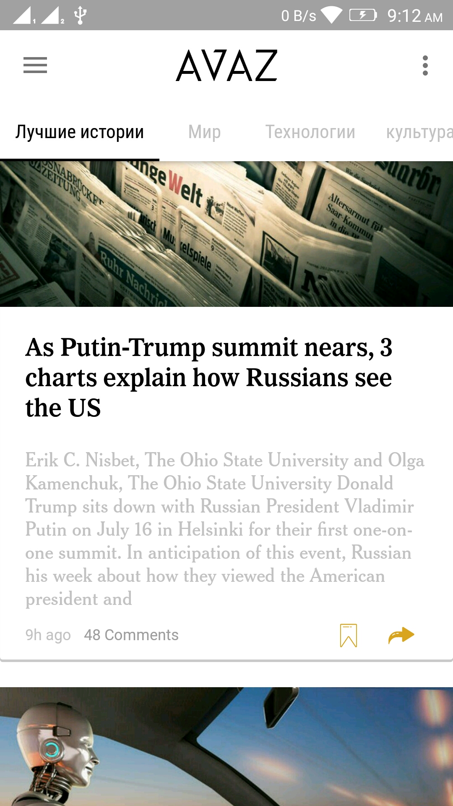
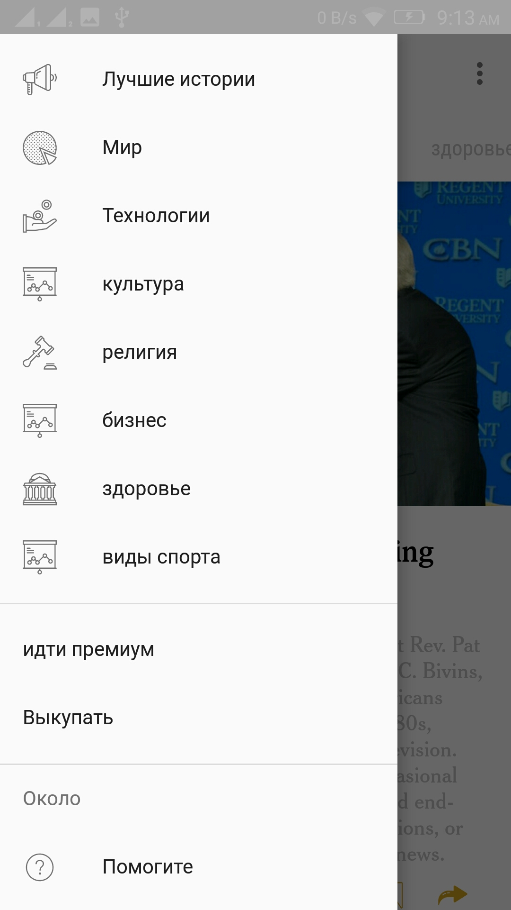
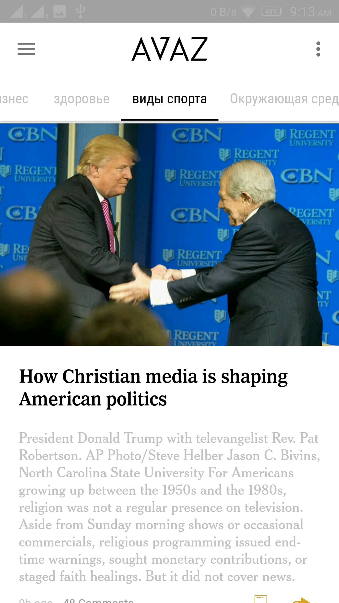
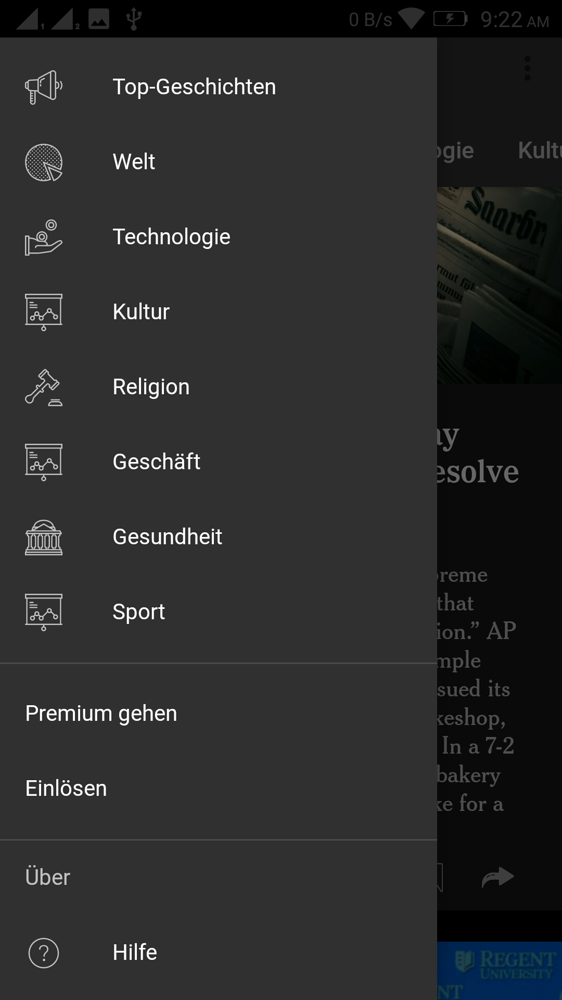
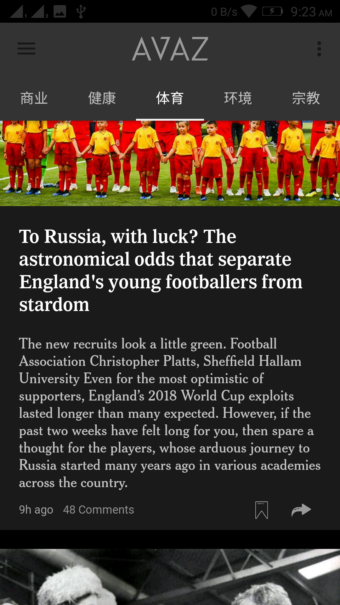
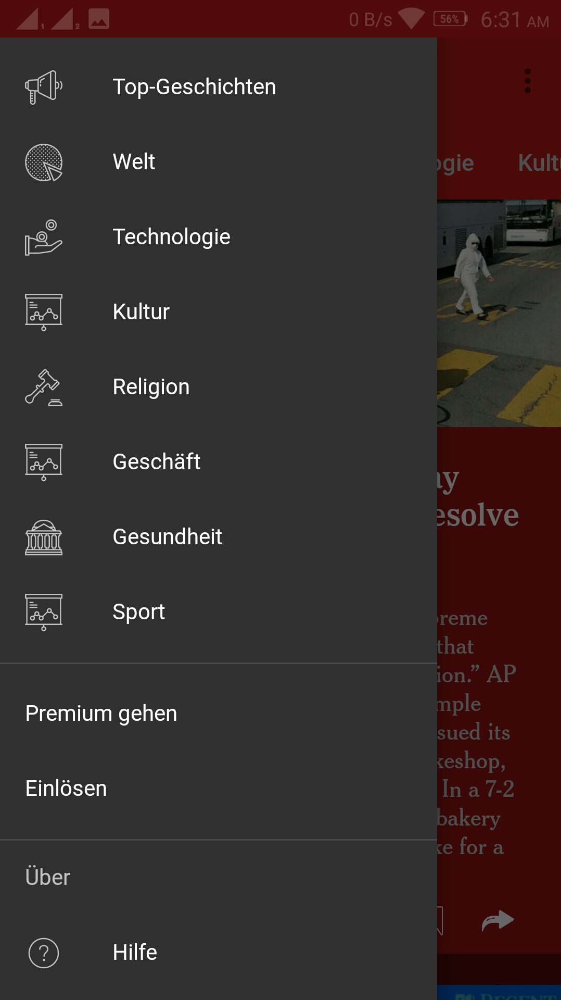
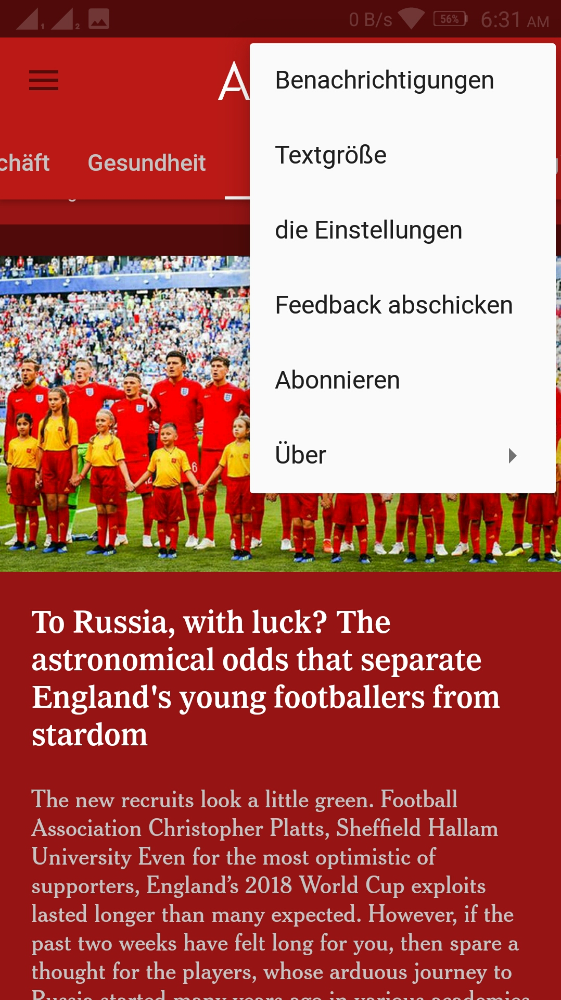

AVAZ
==============

     

Distributed news platform, where you can share news and get paid. Protecting journalists and reporters of the entire world.

**Features:**

- Watch Stories.
- Read reviews from other users
- Mark News as favorites
- Search for News
- Offline work
- Material design
- UI optimized for phone and tablet

**Download:**

You can download APK [on releases page][5].

Screenshots
=============  

Developer setup
---------------

### Requirements

- Java 8
- Latest version of Android SDK and Android Build Tools

If you distribute a copy or make a fork of the project, you have to credit this project as the source.

This program is free software: you can redistribute it and/or modify it under the terms of the GNU General Public License as published by the Free Software Foundation, either version 3 of the License, or (at your option) any later version.

This program is distributed in the hope that it will be useful, but WITHOUT ANY WARRANTY; without even the implied warranty of MERCHANTABILITY or FITNESS FOR A PARTICULAR PURPOSE.  See the GNU General Public License for more details.

You should have received a copy of the GNU General Public License along with this program.  If not, see http://www.gnu.org/licenses/ .

***

License
-------

    Copyright 2018 Mohamed,

    Licensed under the Apache License, Version 2.0 (the "License");
    you may not use this file except in compliance with the License.
    You may obtain a copy of the License at

       http://www.apache.org/licenses/LICENSE-2.0

    Unless required by applicable law or agreed to in writing, software
    distributed under the License is distributed on an "AS IS" BASIS,
    WITHOUT WARRANTIES OR CONDITIONS OF ANY KIND, either express or implied.
    See the License for the specific language governing permissions and
    limitations under the License.
